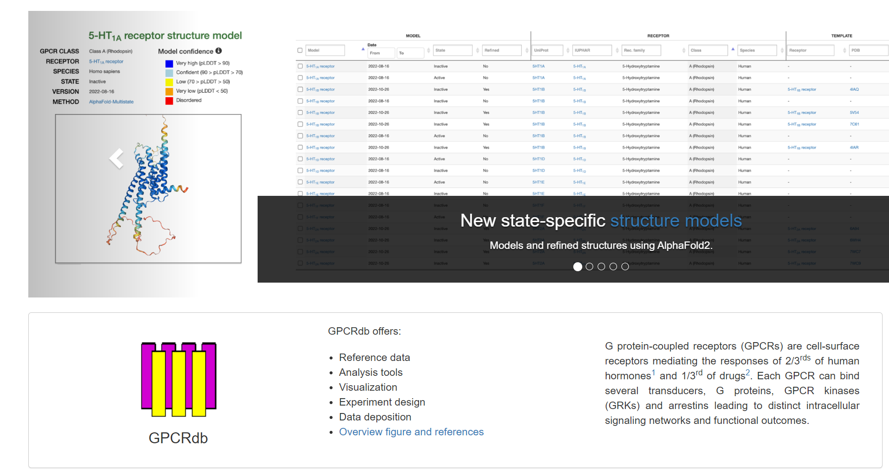

# Sidechain Selection Method - Version 2.0

## Overview

This Jupyter Notebook contains the implementation of the Sidechain Selection Method (Version 2.0). The method is designed to optimize the selection of sidechains in protein structures, ensuring improved accuracy and stability in computational models.

## Contents

- **Introduction**: A brief overview of the purpose and importance of sidechain selection in protein structures.
- **Methodology**: Detailed steps and algorithms used for sidechain selection.
- **Implementation**: Code cells that implement the sidechain selection method.
- **Results**: Outputs and results obtained from the implementation, including visualizations and performance metrics.
- **Conclusion**: Summary of findings and potential future work.

## Getting Started

### Prerequisites

- Python 3.x
- Jupyter Notebook
- Required Python libraries (listed in the `requirements.txt` file)

## Methodology

### Data Acquisition and Contributors

#### Database overview

GPCRdb, or G Protein-Coupled Receptor Database, is a comprehensive database that focuses on G protein-coupled receptors (GPCRs). This database provides detailed information on various aspects related to GPCRs, including genetic variants, drugs, disease indications, ligands, structures, and interactions. Additionally, GPCRdb has been continuously updated and improved over the years, incorporating advanced technologies like AlphaFold2 for state-specific structure models, enhancing the understanding of GPCR biology and drug development.

#### API Access

GPCRdb API is provided by Jimmy Caroli, a website engineer from David’s research group.

#### Backbone Complex Data

All backbone complex data utilized for validation and prediction processes are contributed by Arman Simonyan, a PhD candidate from David’s research group.

#### Scoring Method

The scoring method was suggested and revised by Yashraj Kulkarni, a postdoctoral researcher from David’s research group.

### Generate peptide/receptor residue pair interaction library

#### Steps:

1. Retrieve all structural data currently in the database from GPCRdb via the API. Filter structures to meet specific criteria.
2. Extract the list of interactions between the receptor and the peptide for each structure. Retain specific residue pairs.
3. Compute the median and standard deviation for the Cα - Cα distance and the Cα - Cβ angles. Calculate count and frequency values.

### Calculate Cα, Cβ statistics based on the given backbones

#### Steps:

1. During the validation and prediction processes, calculations of the backbones' Cα and Cβ statistics are performed.
2. Use the API to obtain the corresponding generic residue numbers for each receptor residue.
3. Extract information from receptor and ligand chains.

#### Formulas:

-  Cα - Cα distance 
-  Cα - Cβ angle

### Achieve Ligand Residue Prediction and Sequence Scoring

1. Add a new column "peptide\_amino\_acid" and include all 20 natural amino acid types for each receptor pair.
2. Group and aggregate based on residue number and peptide amino acid.
3. Select the peptide amino acids with the top two highest frequency values as the most likely amino acids for each position.

### Validation Process

1. Select the interacting part of the peptide sequence in each structure file for validation.
2. Retain cases where the effective length of both the predicted and original peptide sequences is at least 5.

#### Evaluation Methods:

- Identity
- Similarity
- Blosum62\_m

### Prediction Process

1. Calculate Cα and Cβ statistics based on the given backbones and achieve ligand residue prediction and sequence scoring.

### Supplementary clarification

- Permutation and combination during the prediction process.
- Collecting true peptide sequence during validation.
- Algorithm limitation regarding unnatural amino acids.
- Additional scoring methods for analyzing the predicted sequence.

## Results

The notebook includes various results such as:
- Visualizations of the original and optimized protein structures.
- Performance metrics comparing different sidechain selection methods.
- Detailed analysis of the improvements in structural stability and accuracy.

## Conclusion

The Sidechain Selection Method (Version 2.0) provides a robust framework for optimizing sidechain selection in protein structures. Future work may include refining the algorithms and expanding the dataset to further validate the method.

## Contributing

Contributions are welcome! Please feel free to submit a Pull Request.

## License

This project is licensed under the MIT License.

## Acknowledgements

- Special thanks to all contributors and researchers who provided valuable insights and data.
- References to key papers and resources used in the development of this method.
